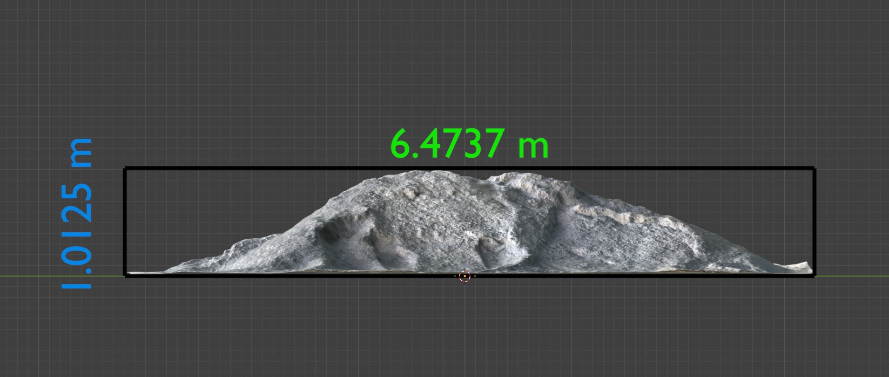
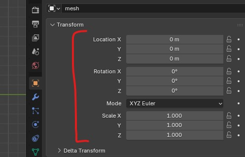
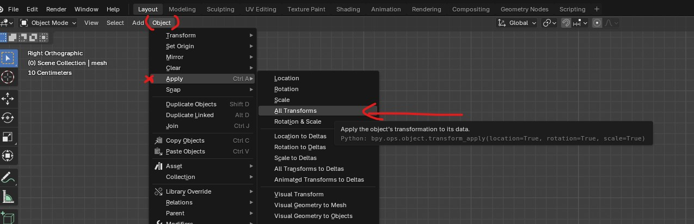
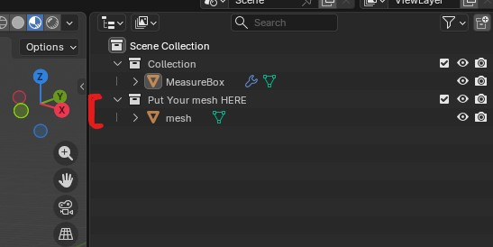
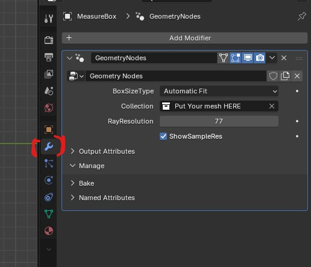

Measuring Volumens of Heaps for Industrial Use with Blender Geometry Nodes
=================

This repo contains geo nodes for measuring the volume of a heap of industrial material scanned to real world measurements. It was made with Blender 5.0.1.

# How To Use

The summary is you import your mesh, you position and rotate it in a way that it is leveled and placed on the ground, you apply the transform, and you drop it on the Put Your Mesh Here collection. You can then read the various measurements simply from the screen, yellow is the volume and the other 3 are the dimension of the box.

1. **Leveling the mesh**: After importing the mesh, your scanned mesh might be rotated or not placed on the ground. Navigate to side views using num pad or Quad view (Ctrl+Alt+Q), then select the mesh and Rotate (shortcut R) and position (shortcut G) until the mesh is leveled like the image below. You would need to do this for both side and front view.

2. **Apply Scale**: The geo node assumes that the scales on the mesh are applied. Under the object property make (the yellow square), make sure all transforms are on zero.

If they are not on zero. Go to Object/Apply/All Transforms to make it so.

3. **Put the Mesh in the Right Collection**: The geo nodes looks at the Put Your Mesh here collection and uses it to measure the volume. So Make sure to put your mesh there. If your geo is very dense and your PC is not great, you might want to only place the mesh there once you are done positioning the mesh in the right spot

Here is an example of the towers. They are purely GN defined, so their controls is on the modifier. There are two type, the round one and the square one. 

## Settings
There are some settings exposed which you can take advantage of. Click on the MeasureBox object and go to the modifier tab (blue wrench):

Here you have
1. Box size type, you can switch between automatic fit, where the measure box will be as large as the item you have put in the collection, or custom, where you can either put the dimension by typing it in, or use the handle gizmos in the 3D viewer to position and scale the box.
2. Collection, this is the collection the node uses to measure the volume, leave it be
3. Ray Resolution, the algo used here is an volume integeration based on samples. N number of rays are shot from the top of the measure box towards the heap, each representing an area. If they hit a surface the height from ground is used to measure the volume under that area which the sum of is the whole volume of the heap. Higher ray resolution is more accurate but more expensive for your PC. 10 rays mean 10x10 (100) rays are shot.
4. Show Sample res, if ticked for every ray a little dot is drawn at the top of the cube. Turn it off to save performance.   
